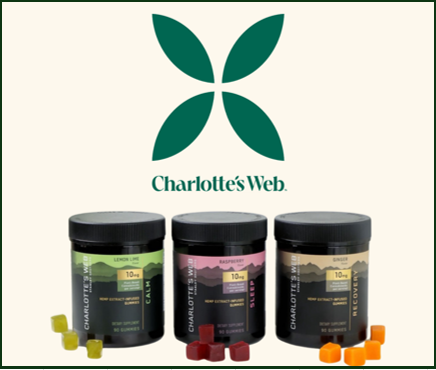
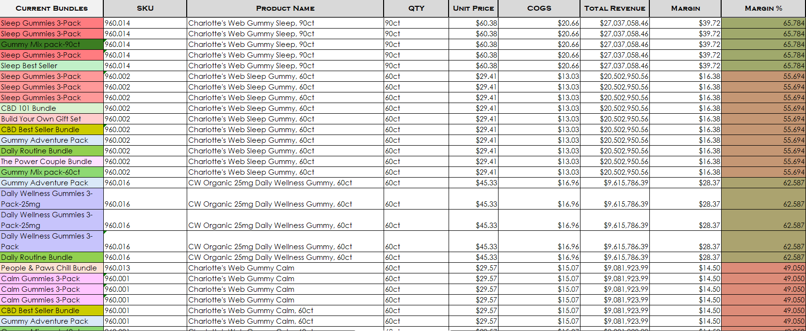
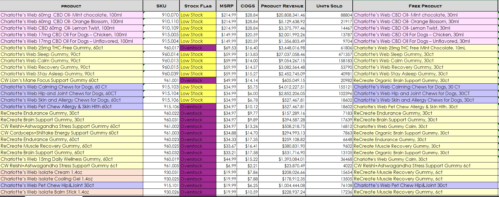
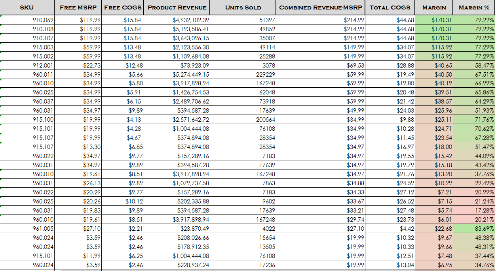
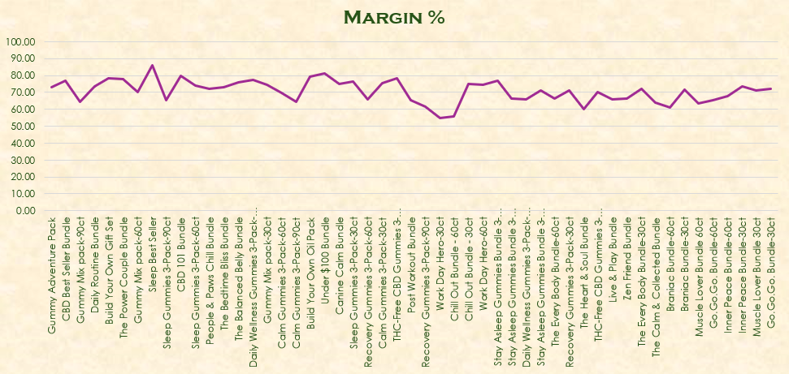

# Margin & Promo Performance Analysis

**Tool:** Microsoft Excel  
**Client:** Charlotte's Web (E-commerce, CBD wellness)  
**Focus:** Profit margin analysis, promotional strategy, bundle optimization

---

## 📌 Project Summary

This project analyzes both **June promotional sales data** and **current bundled product margins** to assess profitability and uncover opportunities to improve pricing and promotional strategy. The goal was to validate whether current bundle configurations were maintaining healthy profit margins—even with promotions—and to identify outliers impacting growth.

---

## 🔍 Key Business Questions

- Are promotional bundles eroding overall profitability?
- Which product bundles are outperforming in terms of margin?
- Can bundling strategy be optimized to increase basket size while maintaining margins?

---

## 📊 Key Insights

### ✅ June Promo Bundle Findings

- **Margin range:** 10% to 83%, with most SKUs remaining profitable despite giveaways. This confirms that even with aggressive promo pricing, margins held strong — a sign of smart bundle structure and strong cost control.
- **Low-margin outlier:** *6ct gummies* — intentionally low margin to attract new customers. This bundle likely serves as a strategic entry product to drive acquisition and encourage trial.
- **Data gaps:** 3 new SKUs missing key data (no reviews or tracked revenue yet), likely due to recent launch. These should be monitored closely to determine if they gain traction or need further optimization.

<table>
  <tr>
    <td></td>
    <td></td>
  </tr>
</table>

### ✅ Current Bundle Margin Findings
- **Margin range:** 54.81% to 85.93%.
- **Top performers:** *CBD Best Seller Bundle*, *Gummy Adventure Pack*, and *CBD 101 Bundle* all show strong COGS optimization and smart product pairing.
- **Lowest margin bundle:** *Work Day Hero-30ct* (54.81%), which still maintains 50%+ margin due to its use as a trial entry point.

### 💡 Strategic Takeaways
- Bundles are increasing **basket size** and **unit volume** without sacrificing profit.
- Low-margin bundles serve as **strategic acquisition tools**, not margin leaks.
- Margin tracking used actual bundle prices (not extrapolated), increasing reliability.

---

## 📈 Business Impact

This analysis confirmed that the company’s **bundle and promo pricing strategy is effective** — enabling high-margin sales, customer onboarding, and scalable promotions. Recommendations from this work help validate bundle mixes, identify which products deserve further investment, and flag areas needing deeper SKU-level tracking.

  

---

## 📁 Files Included

- `📊 CW_Margin_Analysis.xlsx` – includes raw data, pivot analysis, margin calcs, and dashboards.
- Visual summary embedded in workbook (Executive Summary tab).
