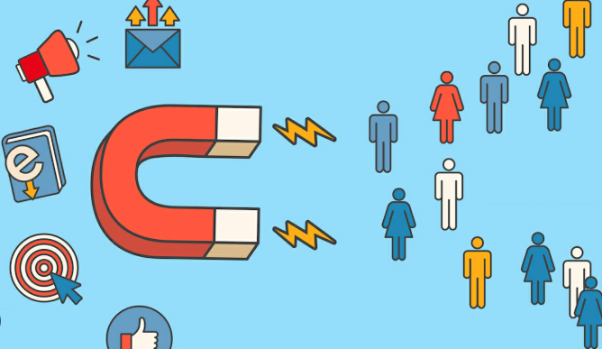

## 📁 Project 2: New vs Returning Customer Behavior Breakdown

### 📊 Summary  
This project focused on uncovering revenue-driving behavior for an e-commerce brand by analyzing trends between new and returning customers. Using Power BI, I built a dynamic dashboard that tracks customer type breakdown, revenue composition, and CAC (Customer Acquisition Cost) over time. The analysis revealed a critical imbalance in acquisition vs. retention efforts, helping the business realign its strategy toward profitable, sustainable growth.

---
### ❓ Business Questions

- Are new customers being acquired efficiently, or are we overspending?  
- What proportion of revenue comes from returning vs. new customers?  
- How is CAC trending month-to-month?  
- Should the business prioritize retention or acquisition going forward?

---

### 📌 Key Metrics
| Metric                          | Value                     |
|----------------------------------|----------------------------|
| **New Customers (YTD)**          | 83,000                    |
| **Returning Customers (YTD)**    | 365,000                  |
| **Revenue from Returning**       | $29.15M (85.33%)         |
| **Revenue from New**             | $5.01M (14.67%)          |
| **Current CAC (July)**           | $49                      |
| **Lowest CAC (Dec)**             | $14                      |

---

### 📈 Dashboard Highlights
- **Bar + Line Combo Chart**: Tracks monthly volume of new vs. returning customers
- **KPI Cards**: YTD total customer counts by type
- **Donut Chart**: Revenue contribution by customer type
- **Line Chart**: Monthly CAC trend

 
 
---

### 🧠 Key Insights & Business Impact
- **Retention is driving the business.** 82% of all YTD customers are returning buyers, and they generate over 85% of revenue — signaling a strong foundation of loyalty.
- **Acquisition efforts are increasingly inefficient.** CAC has more than tripled since December (from $14 to $49), while new customer growth has stalled.
- **The business was over-indexing on paid acquisition**, despite retention being the primary revenue driver.
- This dashboard empowered leadership to shift strategy: reducing spend on underperforming acquisition campaigns and investing more into customer loyalty programs and CLTV initiatives.

By identifying the true revenue engine and visualizing it clearly, this analysis influenced real decision-making and helped the company protect margins while planning for long-term growth.

---
